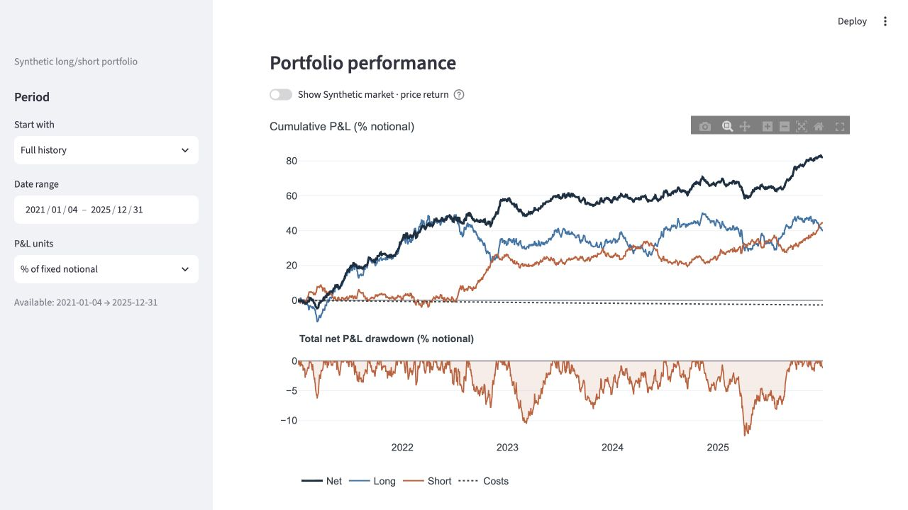

# Portfolio P&L

An interactive Streamlit dashboard for understanding where a long/short portfolio
makes money, where it takes risk, and which holdings drive the result.

**[Open the live dashboard](https://piinghel-portfolio-pnl.streamlit.app/)**

**The included demo is entirely synthetic.** Companies, prices, holdings, factor
returns and the benchmark are generated from a fixed random seed. It illustrates
the software; it is not a backtest or evidence of investment performance.



## Run it

Requires Python 3.11 or newer. From a fresh checkout:

```bash
python -m venv .venv
source .venv/bin/activate
python -m pip install -r requirements.txt
streamlit run app.py
```

On Windows, activate with `.venv\Scripts\activate` instead. The small demo dataset
is included: no API key, market-data subscription or private package is needed.

## Explore

- **Overview:** cumulative gross and net P&L, trading costs, monthly results and
  drawdowns that retain earlier peaks when you change the date window.
- **Risk and reward:** compare stock and sector contributions to return and
  covariance risk over the same dates.
- **Factors:** follow cumulative and periodic contributions, combine selected
  factors, and compare their risk with the rest of the portfolio.
- **Stock detail:** align prices, cumulative P&L and position sizes; inspect
  holding boundaries and switch between linear and logarithmic price scales.
  Click an entry/exit marker to explain its saved prediction: score, selection
  rank, cutoff and the top 5 or 10 predictor contributions. Use **Explain
  decision** to inspect rebalances where a position was retained or resized.

For a short walkthrough, start with Overview, open Worst drawdown in the date
presets, then inspect Biggest losers in Stock detail. Finally, use Factors to
compare Beta and Momentum with the remaining components. Every plot supports
zooming; tables and histories can be downloaded.

## What the numbers mean

P&L is expressed relative to a **fixed $1 million notional**. The main cumulative
chart adds daily P&L; it does not assume profits are reinvested. Drawdowns use the
same additive convention. The optional benchmark compounds its own price returns
and is a separate reference, not a component of portfolio P&L.

Short security P&L is signed: a loss is negative. Trading costs remain separate.
For each day, stock contributions plus costs must equal net portfolio P&L.
The factor partition is checked independently against that same net total.
Input inconsistencies fail explicitly rather than being hidden by chart rounding.

Realized risk contributions use covariance with total portfolio P&L, so a
contribution can be negative or exceed 100% of total variance. Own return/risk
ratios do not add; contributions calculated with net portfolio volatility do.
Factor attribution is descriptive. A residual is not proof of stock-selection
alpha, and sector groupings are not sector-factor attribution.

Entry/exit markers identify changes in saved daily holdings, not verified fills.
Forecast-risk inputs and conventions belong to the supplied data bundle. In this
demo they are known simulation parameters, not a fitted model's estimates.

## Demo data

[`scripts/generate_demo.py`](scripts/generate_demo.py) creates 36 fictional
companies across six sectors over weekdays in 2021–2025. It uses no exchange
holiday calendar. Half the companies are eligible for long positions and half for
short positions. Every 21 weekdays, a synthetic linear score selects the 12
highest-scoring long candidates and the 12 lowest-scoring short candidates.
Selected names receive random target weights; shares otherwise remain constant.
P&L uses previous-close shares, while
displayed holdings reflect closing prices and any rebalance.

Returns combine market/style factors, company-specific noise and a shared
selection component. Hand-designed regimes create sustained trends, a difficult
market, a selection drawdown, and a selloff followed by recovery. Volatility rises
in the stress periods. The long and short populations have designed differences
in drift; their success or failure is part of the illustration, not a learned
prediction. The same seed is retained when refining these scenarios.

The selection score uses ten simulated, standardized inputs with correlated
pairs and fixed, hand-chosen coefficients. They are not measured fundamentals,
and the score is not a fitted forecast or a predicted Sharpe ratio. Inputs are
generated before the rebalance session's return; positions change at its close.
The price process is separate from these inputs, so no predictive relationship
is claimed. Each saved breakdown is exactly intercept + input × coefficient;
it explains portfolio membership, while sizing remains random. Predictor
contributions are distinct from the realized factor P&L attribution.

The displayed factors omit the shared selection component, so the residual is
correlated and can show sustained P&L. Its covariance is included in the simulated
risk calculation. This illustrates why a model's residual is not automatically
independent stock alpha. The broad scenarios are inspired by portfolio behaviour;
no actual security's history or exact portfolio return series is published.

Trading costs are an illustrative 5 bp per unit of traded notional. Borrow,
financing, dividends, corporate actions and market impact are not simulated.
Adjusted and original prices therefore coincide. All demo data is reusable under
the repository's MIT license.

Regenerate the included data:

```bash
python scripts/generate_demo.py
```

## Design and verification

`attribution_dashboard/` contains the UI and chart code. Its `accounting/` package
contains the pure readers and calculations and can be used without Streamlit.
Data is stored in Parquet; lazy Polars queries select the requested dates before
collecting. Streamlit caches have explicit time and entry limits.

The standalone project was extracted from my research dashboard. It includes the
components needed to explore saved attribution ledgers; it does not include the
private strategy, predictor pipeline, optimizer or market-data downloads.

```bash
python -m pip install -e '.[dev]'
pytest -q
ruff check .
```

Tests cover ledger reconciliation, date-window rebasing, covariance contributions,
holding boundaries, missing coverage, factor drilldowns, display units and the
linear/log price switch. The demo smoke test exercises all four pages.

To connect your own data, see [the bundle contract](docs/data-format.md) and change
the relative path in `config.yaml`. Additional datasets are ignored by Git by
default; only `data/demo/` is included in this repository.

## Deploy

For Streamlit Community Cloud, select this repository, branch `main`, and
`app.py` as the entry point, with Python 3.12. `requirements.txt` and
`.streamlit/config.toml` contain the demo dependencies and theme. No secrets are
required. The live demo automatically updates when changes are pushed to `main`.
See the [official deployment instructions](https://docs.streamlit.io/deploy/streamlit-community-cloud/deploy-your-app/deploy).

## Author and license

Pieter-Jan Inghelbrecht · [Research blog](https://piinghel.github.io/)

MIT license. Dependency licenses remain their respective authors' licenses.
